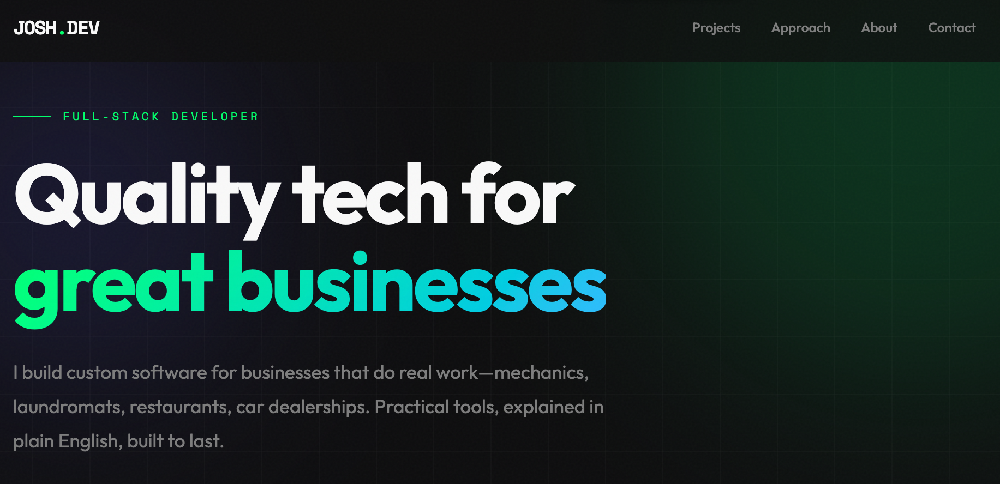

# demberry.com

Personal portfolio site for Josh Dicker - Full-Stack Developer.

## Live Site

**[→ demberry.com](https://josdic1.github.io/demberry.com/)**

## About

Portfolio showcasing custom software built for traditional businesses—mechanics, laundromats, restaurants, car dealerships. Practical tools, explained in plain English, built to last.

## Featured Projects

- **SlateSnap** - Photo documentation for roofing crews
- **aTrakk** - Music project tracking for artists
- **CheatCode** - Personal code snippet manager with dev tools
- **Bookafella** - Private club reservation system
- **LaundroSpin** - Smart laundromat management

## Tech Stack

- HTML
- CSS
- Vanilla JavaScript

## Contact

- [GitHub](https://github.com/josdic1)
- [LinkedIn](https://linkedin.com/in/joshdicker)
