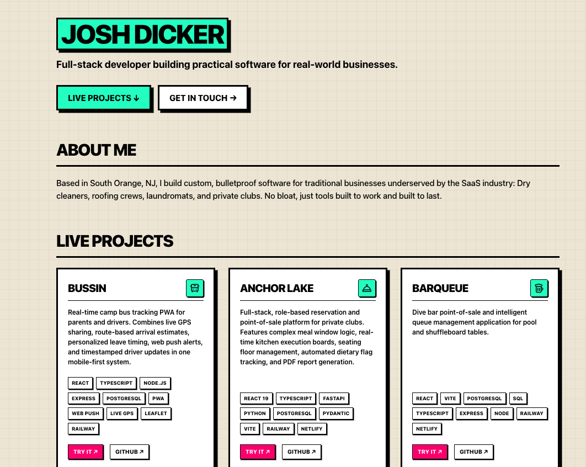

# demberry.com

Personal portfolio for Josh Dicker, a full-stack developer building practical software for real-world organizations and businesses.

## Live Site

**[View the portfolio →](https://josdic1.github.io/demberry.com/)**

## About

I design and build focused, full-stack applications for organizations underserved by generic software—from schools, camps, and private clubs to bars, laundromats, bakeries, and retail operations.

No bloated dashboards or unnecessary features—just reliable tools built around how people actually work.

## Featured Projects

- **Bussin** — No-signup, real-time school and camp bus tracking with live GPS, arrival estimates, personalized leave timing, push notifications, and driver updates.
- **Anchor Lake** — Role-based reservation, point-of-sale, kitchen operations, seating, and reporting platform for private clubs.
- **BarQueue** — Dive-bar point-of-sale and intelligent queue management for pool and shuffleboard tables.
- **TipsyGenius** — Real-time trivia platform with host controls, public displays, mobile team participation, and automated grading.
- **LaundroSpin** — Smart laundromat management with live machine tracking, buffer pricing, and overstay penalties.
- **SoMama** — Bakery operations system for weekly orders, customer records, pickup flow, and administrative workflows.

## Built With

- HTML
- CSS
- Vanilla JavaScript
- Lucide Icons

## Contact

- [GitHub](https://github.com/josdic1)
- [LinkedIn](https://linkedin.com/in/joshdicker)
- [Email](mailto:emailjoshdicker@gmail.com)
